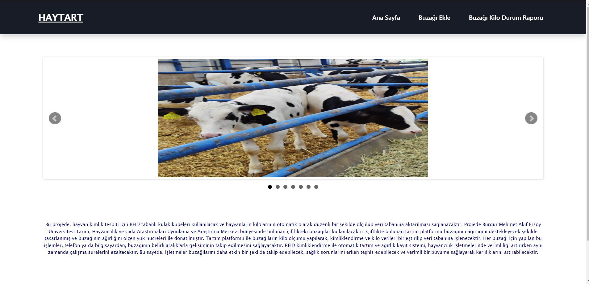
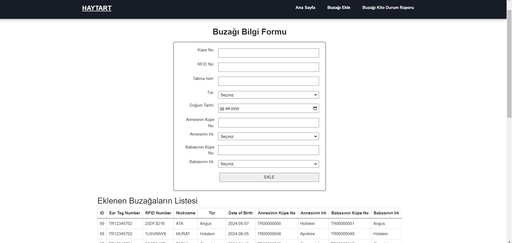
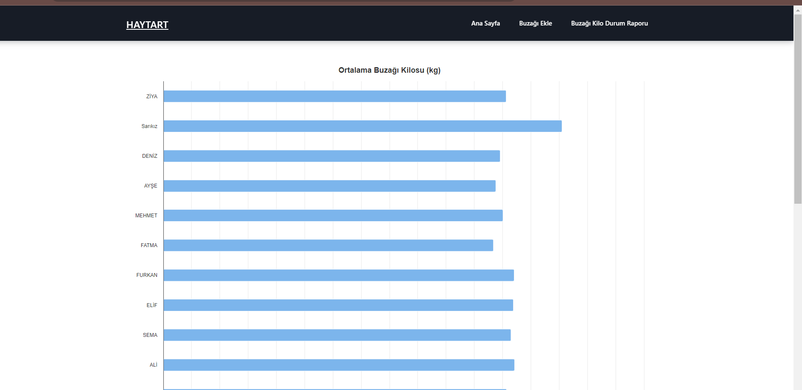
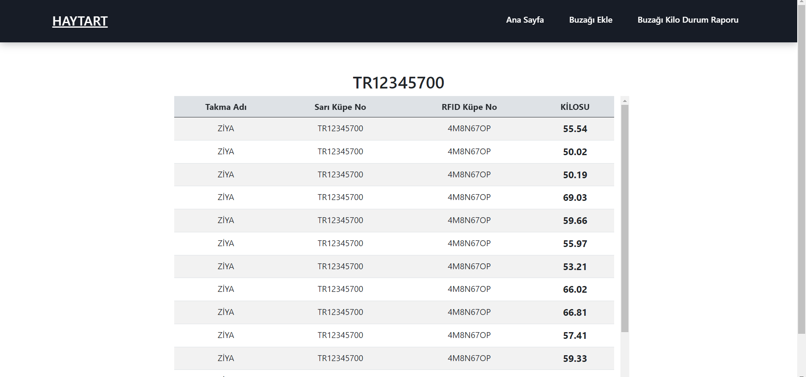
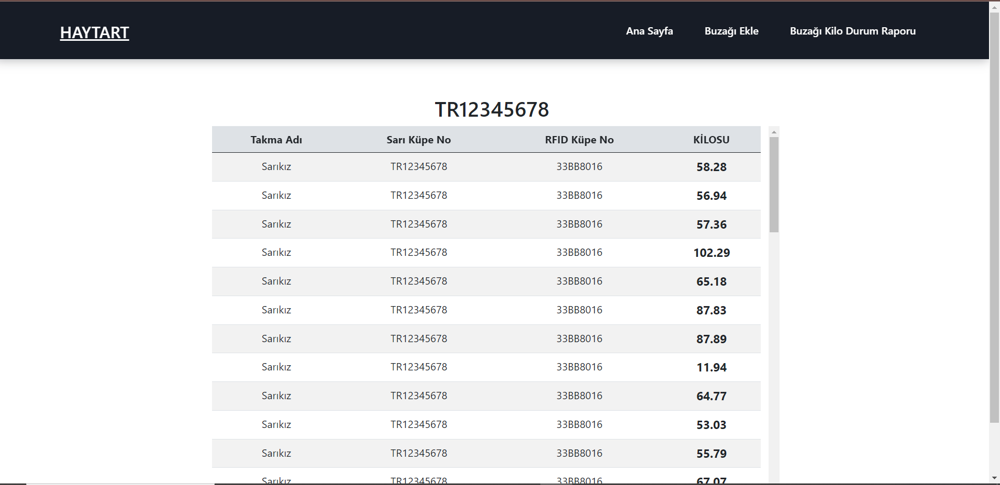

# RFID ile Buzağıların Kimliklendirilmesi ve Hassas Tartı ile Ölçüm Değerlerinin Web Sayfasına Yansıtılması

1. **Ana Sayfa**: Buzağıların kimliklendirilmesi ve ölçüm değerlerinin görüntülenmesi için oluşturulan ana sayfa 
    [kodunu görmek için tıkla](https://github.com/AleynaKocaman/calf/blob/main/homepage.php).  

   

2. **Buzağı Ekleme Sayfası**: Yeni buzağıların eklenmesi için kullanılan sayfanın ekran görüntüsü
    [kodunu görmek için tıkla](https://github.com/AleynaKocaman/calf/blob/main/addcalf.php). 

   

3. **Buzağı Kilo Durum Raporu Sayfası**: Buzağıların kilo durumlarını raporlayan sayfanın ekran görüntüsü 
    [kodunu görmek için tıkla](https://github.com/AleynaKocaman/calf/blob/main/calfkg.php) .

   

4. **Bireysel Buzağı Kilo İnceleme Sayfası**: Her bir buzağının kilo verilerini bireysel olarak incelemek için kullanılan sayfanın ekran görüntüsü
    [kodunu görmek için tıkla](https://github.com/AleynaKocaman/calf/blob/main/onecalfkg.php) .

Ziya adlı buzağının bireysel inceleme raporu

   

Sarıkız  adlı buzağının bireysel inceleme raporu
 
   

Bu web sayfaları, RFID teknolojisiyle buzağıların kimliklendirilmesi ve hassas tartı kullanılarak elde edilen ölçüm değerlerinin kolayca takip edilmesini ve yönetilmesini sağlar.
